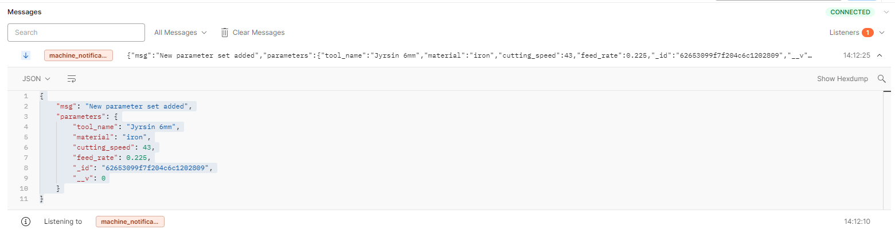

# REST API for Industry Machine
- Application can create, update and delete parameter sets of an industry machine
- Websocket connection can be established to receive notifications from update, deleted and created parameter sets. Notifications will be broadcasted to all established connections.
- The service is running at: https://machine-restapi.herokuapp.com

> For notifications subscribe machine_notifications listener

## Implemented CRUD commands for Machine Rest API

### Create new machine parameter set 
Send POST command to following address together with machine parameters.
> /api/machining-parameter-set

- Machine parameter model follows predefined structure as
    - tool_name (String)&emsp;&emsp;&emsp;&emsp;&emsp;- Name of the tool
    - material (String)&emsp;&emsp;&emsp;&emsp;&emsp;&emsp;- Type of the material
    - cuttring_speed (Number)&emsp;&emsp;- Cutting speed for given material
    - feed_rate (Number)&emsp;&emsp;&emsp;&emsp; - Feeding rate
 

### Retrieve all machine parameter sets
> /api/machining-parameter-sets

Send GET command to following address to receive all possible parameter sets created for the industry machine.
 
 
### Retrieve specific machine parameter set
> /api/machining-parameter-set/:id

Send GET command to following address together with desired parameter set id to receive specific machine parameters.
 
 
### Update specific machine parameter set
> /api/machining-parameter-set/:id

To update specific machine parmaeter set, send PUT command to following address together with parameter set id and updated parameter set.

### Delete machine parameter set
> /api/machining-parameter-set/:id

Delete specific machine parameter set, send DELETE command to following address together with parameter set id.
